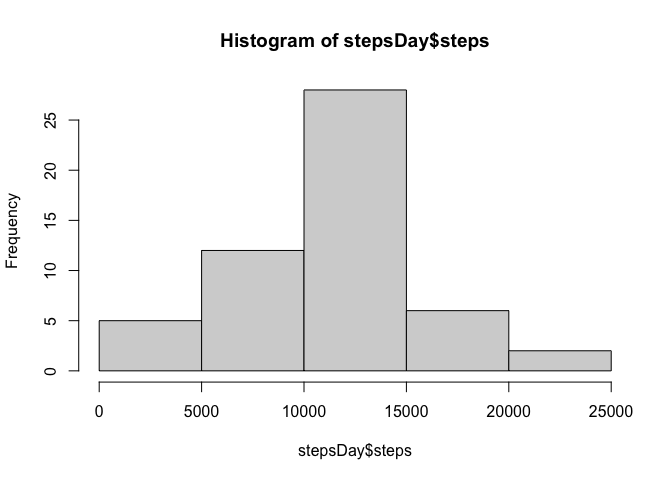
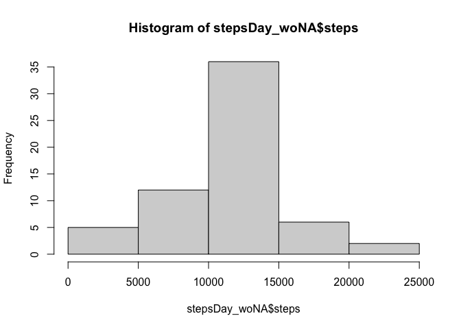

## Loading and preprocessing the data


```r
# Load packages
library(lattice)
# Open table
dataset <- read.csv("activity.csv")
```

## Wat is mean total number of steps taken per day?
Total number of steps taken per day


```r
stepsDay <- aggregate(steps ~ date, dataset, sum, na.rm = T)
```

Histogram of the total number of steps taken each day


```r
hist(stepsDay$steps)
```

<!-- -->

Mean and median of the total number of steps taken per day


```r
stepsDay_mean <- mean(stepsDay$steps)
stepsDay_mean
```

```
## [1] 10766.19
```

```r
stepsDay_median <- median(stepsDay$steps)
stepsDay_median
```

```
## [1] 10765
```

##  Wat is the average daily activity pattern?
Time series plot


```r
stepsInterval <- aggregate(steps ~ interval, dataset, mean, na.rm = T)
plot(steps ~ interval, data = stepsInterval, type = "l")
```

<!-- -->

Which 5-minute interval, on average across all the days in the dataset, contains the maximum number of steps?


```r
stepsInterval_max <- stepsInterval[which.max(stepsInterval$steps), "interval"]
stepsInterval_max
```

```
## [1] 835
```

##  Imputing missing values
Calculate and report the total number of missing values in the dataset


```r
NA_number <- length(which(is.na(dataset$steps)))
NA_number
```

```
## [1] 2304
```

Strategy to fill in all of the missing values: mean value of the corresponding 5-minute interval


```r
getMeanInterval <- function(interval) {
    stepsInterval[stepsInterval$interval == interval, "steps"]
}
```

Create a new dataset that is equal to the orginal dataset but with the NAs filled in


```r
dataset_woNA <- dataset

for(i in 1:NROW(dataset_woNA)){
    if(is.na(dataset_woNA[i, "steps"])){
        dataset_woNA[i, "steps"] <- getMeanInterval(dataset_woNA[i, "interval"])
    }
}
```

Make a histogram of the total number of steps taken each day and calculate and report the mean and median  

* Do these values differ from the estimates from the first part of the assignment?
* What is the impact of imputing missing data on the estimates of the total daily number of steps?

Histogram


```r
stepsDay_woNA <- aggregate(steps ~ date, dataset_woNA, sum)
hist(stepsDay_woNA$steps)
```

<!-- -->

Mean and median


```r
stepsDay_woNA_mean <- mean(stepsDay_woNA$steps)
stepsDay_woNA_mean
```

```
## [1] 10766.19
```

```r
stepsDay_woNA_median <- median(stepsDay_woNA$steps)
stepsDay_woNA_median
```

```
## [1] 10766.19
```

Difference with first part of assignment, when NA were removed


```r
stepsDay_woNA_mean - stepsDay_mean
```

```
## [1] 0
```

```r
stepsDay_woNA_median - stepsDay_median
```

```
## [1] 1.188679
```

## Are there differences in activity patterns between weekdays and weekends?

Create a new factor variable in the dataset with two levels – “weekday” and “weekend” indicating whether a given date is a weekday or weekend day.

```r
dataset_woNA$date <- as.Date(strptime(dataset_woNA$date, format = "%Y-%m-%d"))
dataset_woNA$weekday <- weekdays(dataset_woNA$date)
weekend_days <- c("Saturday", "Sunday")
for (i in 1:NROW(dataset_woNA)) {
    if (dataset_woNA[i, "weekday"] %in% weekend_days) {
        dataset_woNA[i, "day"] <- "weekend"
    }
    else {
        dataset_woNA[i, "day"] <- "weekday"
    }
}
```

Make a panel plot containing a time series plot (i.e.type = "l") of the 5-minute interval (x-axis) and the average number of steps taken, averaged across all weekday days or weekend days (y-axis).

```r
stepsDay_woNA_week <- aggregate(steps ~ interval + day, dataset_woNA, mean)
xyplot(steps ~ interval | day, stepsDay_woNA_week, type = "l", layout = c(1, 2), 
       xlab = "Interval", 
       ylab = "Number of steps")
```

<!-- -->
